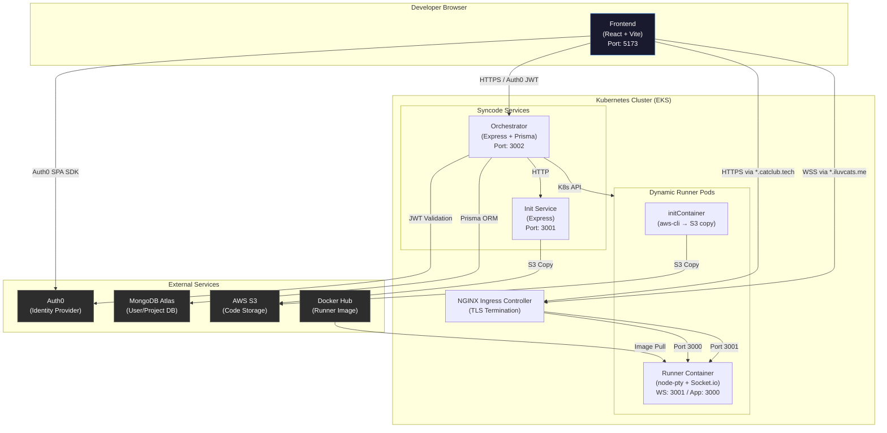

# Syncode — Deployment Diagram

Runtime topology and network relationships of the Syncode platform.

## Mermaid Diagram

## Component Mapping

| Diagram Element | Source Code | Key Files |
|-----------------|-------------|-----------|
| Frontend | `frontend/` | `src/App.tsx`, `src/auth/AuthProvider.tsx` |
| Orchestrator | `orchestrator/` | `src/index.ts`, `prisma/schema.prisma` |
| Init Service | `init-service/` | `src/index.ts`, `src/aws.ts` |
| Runner | `runner/` | `src/index.ts`, `src/ws.ts`, `src/pty.ts`, `Dockerfile` |
| Ingress | `k8s/` | `ingress-controller.yaml` |
| K8s Manifests | `orchestrator/` | `service.yaml`, `service.yaml.example` |
| K8s Secrets | `k8s/` | `runner-secrets.yaml` |

## Network Boundaries

### Public (via Ingress)
- `*.iluvcats.me` → Runner WebSocket (port 3001)
- `*.catclub.tech` → Runner user app (port 3000)
- Frontend (static hosting or dev server)

### Internal (ClusterIP)
- Orchestrator → K8s API server
- Init Service → S3
- InitContainer → S3

### External APIs
- Frontend → Auth0 (OAuth2 PKCE flow)
- Orchestrator → Auth0 (JWT validation)
- Orchestrator → MongoDB Atlas (Prisma)

## Ports & Protocols

| Connection | Protocol | Port |
|------------|----------|------|
| Frontend → Orchestrator | HTTPS / HTTP | 3002 |
| Frontend → Runner (terminal/files) | WSS / WS | 3001 |
| Frontend → Runner (app preview) | HTTPS / HTTP | 3000 |
| Orchestrator → MongoDB | MongoDB protocol | 27017 |
| Init Service → S3 | HTTPS | 443 |
| InitContainer → S3 | HTTPS | 443 |

## Security Notes

- **Auth0 JWT** protects all Orchestrator API routes
- **K8s Secrets** store AWS credentials for runner pods (not hardcoded)
- **IRSA** recommended in production (IAM Roles for Service Accounts)
- **TLS** should be terminated at the Ingress level
- **Network Policies** restrict pod-to-pod communication
- **Resource Limits** should be set on runner pods to prevent abuse