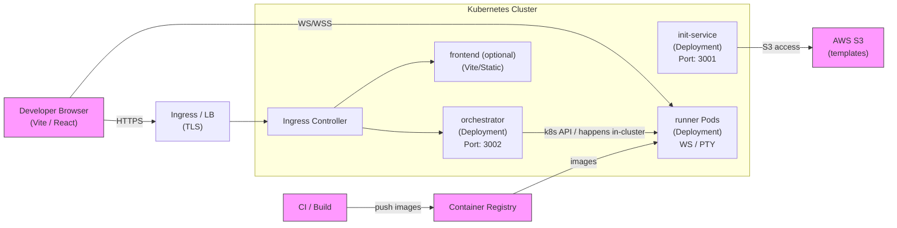

# Deployment Diagram — How to design for this project

This document explains how to create a clear deployment diagram for the Syncode project in this workspace. It covers what elements to include, how to map diagram elements to repository artifacts, notation and layout tips, a Mermaid example diagram you can iterate from, and a verification checklist.

## Purpose

Make a deployment diagram that communicates the runtime topology and network relationships of the system:
- Which processes run where (developer browser, Kubernetes cluster, cloud services).
- Which containers and services communicate with which external systems (S3, container registry).
- Ports, protocols, and important runtime assumptions (service accounts, IAM, volumes).

The diagram should be usable for onboarding, operations runbooks, and architecture reviews.

## Key stakeholders and audience
- Developers working on the Syncode services (frontend, init-service, orchestrator, runner).
- DevOps/Kubernetes operators deploying the runner/orchestrator stacks.
- Security reviewers who need to understand network boundaries and IAM roles.

Design the diagram for a technical audience; annotate with filenames and manifest references where helpful.

## Core elements to include
1. Developer (client)
   - Browser/IDE that interacts with the frontend (Vite dev server) and WebSocket/HTTP endpoints.
2. Ingress / Load Balancer
   - Ingress controller (see `k8s/ingress-controller.yaml`) or cloud LB
   - TLS termination point
3. Kubernetes cluster (one box in diagram that expands to logical pieces)
   - Namespace(s) used for the app
   - Deployments/Pods: `orchestrator`, `init-service`, `runner` (runner's PTY server + web socket), frontend (if deployed)
   - Services for internal routing (ClusterIP, NodePort)
4. Storage and external systems
   - AWS S3 (template storage) — used by `init-service`
   - Container registry (if container images are built)
   - Optional: PersistentVolumes / Claims (for runner workspace)
5. CI / CD and build systems (if relevant)
   - Where container images are built and pushed
6. External users/clients and monitoring
   - Developer workstation, logging/metrics backends (optional)

Label each node with its name, key ports, and one-line responsibility.

## Map diagram elements to repository files
- Frontend (dev server & static assets): `frontend/` (Vite + React).
- Init service (project bootstrap from S3): `init-service/src/`.
- Orchestrator (creates k8s resources): `orchestrator/src/` and `orchestrator/service.yaml`.
- Runner (PTY, web socket, file ops): `runner/src/` and `runner/Dockerfile`.
- Kubernetes manifests: `k8s/` and individual manifest files referenced under each service.

Include these file paths near the corresponding elements in the diagram (small italic text or note icons).

## Ports & protocols (important labels)
- HTTP/HTTPS: 80/443 — ingress to frontend/orchestrator/runners
- WebSocket: e.g., ws:// or wss:// endpoint served by the runner (port depends on deployment)
- Runner PTY within Pod: internal TCP used by PTY library (exposed over socket.io)
- Orchestrator API: REST endpoints used by the frontend (`/start`, `/stop`) — show port (e.g. 3002) if relevant to your environment
- Init-Service API: HTTP port (e.g. 3001) for creating projects

Always annotate ports on the arrows between nodes.

## Security & identity annotations
- Show which components need AWS credentials (e.g., `init-service` needs S3 access). Indicate whether credentials are provided via:
  - Kubernetes Secrets
  - ServiceAccount + IAM Roles (IRSA or equivalent)
- Show which components are public vs private (publicly reachable via ingress or only internal ClusterIP).
- Indicate whether traffic is encrypted (TLS) between ingress and services.

## Kubernetes mapping guidance
For each Kubernetes object, show a short mapping like:
- Deployment: `orchestrator` → `orchestrator/` (Deployment spec & Service)
- Deployment: `runner` → `runner/Dockerfile` and `runner` source files
- Ingress: see `k8s/ingress-controller.yaml`
- Volumes: any `PersistentVolumeClaim` used by runner for workspace data

Include arrows for: Ingress → Service → Pod (Deployment).

## Layout and visual design tips
- Use layers: top = external actors (Developer, CI/CD, Registry), middle = cluster boundary (box with rounded corners), bottom = cloud managed services (S3, Auth).
- Use colors consistently: one color for public-facing paths, another for internal communication.
- Avoid overcrowding: use swimlanes or grouped nodes for related services (e.g., group all syncode microservices).
- Provide a legend for symbols and colors.

## Notation and symbols (UML-style deployment)
- Node: execution environment (Kubernetes cluster, Node, Container host)
- Component / Artifact: containers, services, or files (e.g., `runner:container`)
- Association: network arrow labeled with protocol and port
- Note: add file path references and manifest names as side-notes

## Example (Mermaid flow) — use as a starting point

Notes:
- The Mermaid example is intentionally simplified. Use a drawing tool (draw.io / diagrams.net, Lucidchart) to create a higher-fidelity diagram with bounding boxes, icons, and file mappings.

## Exporting and sharing
- Use draw.io / diagrams.net (free) or Lucidchart/Figma for visually-rich diagrams.
- For quick text-driven diagrams, use Mermaid embedded in Markdown (GitHub supports Mermaid in some contexts) or PlantUML for UML-style deployment diagrams. Export to PNG/SVG for slides or documentation.

## Verification checklist (before finalizing diagram)
- [ ] All runtime components are represented (init-service, orchestrator, runner, frontend).
- [ ] Ports and protocols are labeled on edges.
- [ ] Public vs private boundaries are clear (ingress vs ClusterIP).
- [ ] External dependencies (S3, Registry, CI) are shown and their access patterns are annotated.
- [ ] Kubernetes objects (Ingress, Service, Deployment, PVC) are mapped to file paths where the manifests live.
- [ ] Security notes: service accounts, secrets, TLS boundaries, and IAM roles are called out.
- [ ] Diagram file is saved into the repository docs folder or root (e.g., `docs/architecture/`), and a small README references it.

## Where to put the final diagram file in this repo
- Suggested path: `d:\My Codes\Syncode\docs\architecture\deployment-diagram.{drawio|png|svg|md}`
- Keep a source format (drawio or Figma) and an exported PNG/SVG for easy consumption.

## Suggested next steps (optional)
1. Create a `docs/architecture` folder and add this diagram and a short `README.md` explaining how to regenerate it.
2. If you want, I can generate a PlantUML or a more detailed Mermaid deployment example that includes the real port numbers and file paths from this repo.
3. Review with the DevOps team to confirm service account and ingress/TLS details; update diagram accordingly.

---

If you want, I can now:
- Save this as `d:\My Codes\Syncode\DEPLOYMENT_DIAGRAM.md` (done), or
- Also create a `docs/architecture/` folder and add a high-fidelity `deployment-diagram.drawio` or `deployment-diagram.png` placeholder, or
- Produce a PlantUML source version of the same diagram for offline rendering.

Tell me which of those follow-ups to do next.